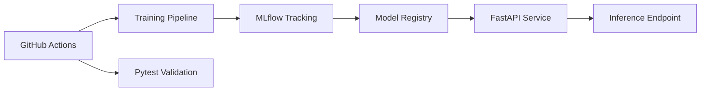

# 🧠 MLOps Breast Cancer Classification Pipeline

<p align="center">

<!-- Tech Stack Badges -->


</p>


A production-ready machine learning system implementing an end-to-end MLOps pipeline for breast cancer diagnosis. This project leverages Scikit-Learn for modeling, MLflow for experiment tracking and model registry, and FastAPI for real-time inference.

## 📊 Key Performance Metrics

The system achieves state-of-the-art results on the UCI Breast Cancer Wisconsin dataset:

| Metric | Training Set | Test Set |
|--------|--------------|----------|
| Accuracy | 98.90% | 98.25% |
| Precision | 98.28% | 98.61% |
| Recall | 100.00% | 98.61% |
| F1 Score | 99.13% | 98.61% |

> **Note:** High recall (98.61%) is prioritized to minimize false negatives in medical diagnostics.

## 🏗 System Architecture


## 🛠 Tech Stack

- **Modeling:** Python 3.9+, Scikit-Learn
- **MLOps:** MLflow (Tracking, Projects, Registry)
- **Deployment:** FastAPI, Uvicorn, Docker
- **CI/CD:** GitHub Actions
- **Database:** SQLite (MLflow Backend)
- **Testing:** Pytest

## 🚀 Quick Start

### 1. Environment Setup
```bash
git clone https://github.com/sushmithameduri/mlops-breast-cancer.git
cd mlops-breast-cancer
python3 -m venv venv
source venv/bin/activate
pip install -r requirements.txt
```

### 2. Execute Training Pipeline

Train the model with integrated MLflow tracking and registration:
```bash
python app/train.py
```

### 3. Run Inference Service

Launch the FastAPI server to serve predictions:
```bash
uvicorn app.main:app --reload
```

Access interactive Swagger documentation at `http://localhost:8000/docs`.

### 4. Containerization

Build and run the production-ready Docker container:
```bash
docker build -t breast-cancer-api .
docker run -p 8000:8000 breast-cancer-api
```

## 🧪 Testing & Quality Gates

The project includes a comprehensive suite of automated tests to ensure model and API integrity:

- **Model Validation:** Verifies loading, data scaling consistency, and performance thresholds (Accuracy > 85%, Recall > 80%).
- **API Testing:** Validates root, health-check, and prediction endpoints.
```bash
# Run all tests
pytest -v
```

## 📈 MLflow Capabilities Demonstrated

- **Experiment Tracking:** Logs 9+ metrics and 7+ hyperparameters per run.
- **Model Registry:** Version-controlled lifecycle management (Staging/Production).
- **Artifact Management:** Secure storage of `model.pkl`, `scaler.pkl`, and metadata.

## 👩‍💻 Author

**Sushmitha Meduri**  
MS in Data Science | Building reliable, production-grade ML systems.
